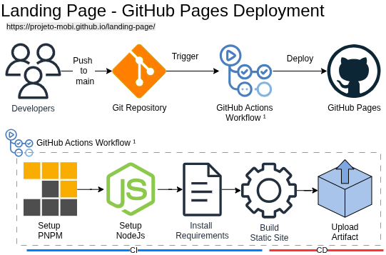

# Arquitetura da Solução

## 1. Visão Geral

Este documento descreve a arquitetura da landing page.

A solução consiste em uma aplicação web estática, cujo código é versionado no GitHub e publicado automaticamente por meio de um pipeline de CI/CD (GitHub Actions), sendo entregue ao usuário final via GitHub Pages.

---

## 2. Objetivo e Escopo

### Objetivo

A landing page tem como objetivo:
- Apresentar o escopo do projeto Mobi para público geral;
- Divulgar o projeto e possibilitar formas de contato e compartilhamento;
- Acesso ao dashboard da aplicação final;
- Servir como aplicação de onboarding do projeto;

### Escopo

#### Incluído
- Interface web responsiva
- Conteúdo estático
- Pipeline automatizado de build e deploy
---

## 3. Tecnologias Adotadas

| Camada        | Tecnologia                     |
|---------------|-------------------------------|
| Front-end     | (React / Next / Vite)         |
| Linguagem     | (TypeScript / JavaScript)     |
| Gerenciador   | pnpm                          |
| CI/CD         | GitHub Actions                |
| Hosting       | GitHub Pages                  |

---

## 4. Arquitetura da Solução

O código-fonte da aplicação é mantido em um repositório GitHub. A cada atualização na branch `main`, um workflow do GitHub Actions é acionado, responsável por instalar dependências, executar o build da aplicação e publicar no GitHub Pages os artefatos gerados.

---

## 5. Componentes e Diagrama

### Diagrama de Arquitetura

### Componentes Principais

**GitHub Repository**  
Armazena o código-fonte da aplicação.

**GitHub Actions**  
Executa o pipeline de CI/CD:
- instalação de dependências
- build da aplicação
- deploy

**Static Site(`dist`)**  
Resultado do processo de build contendo arquivos HTML, CSS e JavaScript.

**Artifact Upload**  
Upload do artefato para deploy no GitHub Pages

---

## 6. Publicação e CI/CD

O processo de publicação ocorre da seguinte forma:

1. Push na branch `main` ou execução manual
2. Execução do workflow no GitHub Actions
3. Instalação das dependências
4. Build da aplicação
5. Deploy dos arquivos estáticos

Após o processo, a landing page é disponibilizada ao usuário final via GitHub Pages.

---

## 7. Operação e Evolução

### Operação
- Deploy automatizado via GitHub Actions
- Atualizações realizadas via push na branch principal
- Logs disponíveis no GitHub Actions

### Evolução Futura
- Integração com formulário ou CRM
- Adição de analytics
- Implementação de testes automatizados
- Adição de linter no workflow

---